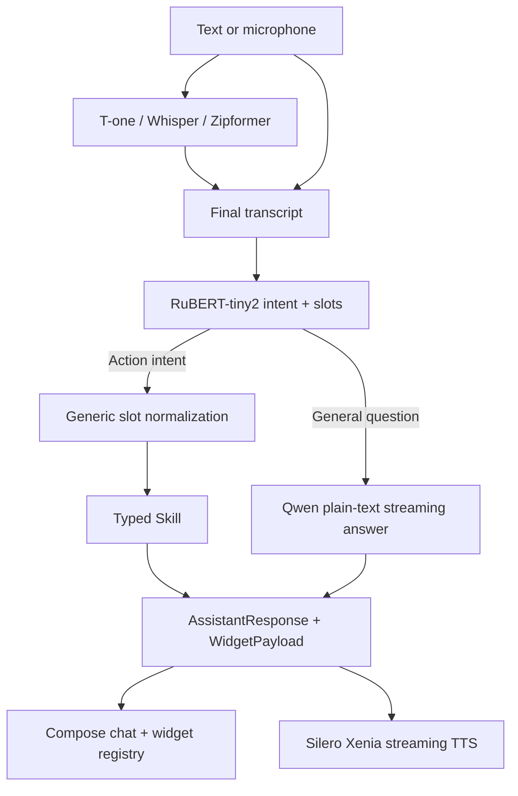

# Android Offline Assistant PoC

Private Android technology demo of a voice-first assistant whose speech recognition, command routing, general-question LLM and speech synthesis run on the phone.

The current PoC demonstrates the complete vertical path:

- T-one streaming ASR by default, with Whisper Base and Zipformer selectable in Settings;
- RuBERT-tiny2 intent and slot classification for deterministic actions;
- Qwen2.5 0.5B through llama.cpp for plain-text answers to general questions;
- Silero v5.5 RU/Xenia through ONNX Runtime for local speech output;
- Jetpack Compose chat with structured result widgets and streaming responses;
- offline timer, alarm, reminder, note, calculator, app launch, help and mock/cache weather flows;
- Debug, widget preview, model telemetry and device acceptance tooling.

Qwen is deliberately not an action parser. It does not generate command JSON or repair RuBERT classifications.

## Architecture



Reusable contracts, NLU normalization and skills live in `:core`. Android UI, permissions, persistence, model runtimes, JNI and platform adapters live in `:app`.

## Repository Layout

```text
app/                 Android application, Compose UI, JNI and model adapters
benchmark/           Macrobenchmark and baseline-profile journeys
core/                Pure Kotlin assistant contracts, routing and skills
docs/                Product, design, implementation and acceptance documents
scripts/             Host and connected-device acceptance runners
training/            RuBERT dataset, fine-tuning, ONNX export and evaluation
tools/               ASR fixture and Silero export/staging utilities
third_party/          Pinned whisper.cpp Git submodule
models/               Ignored generated and externally downloaded model bundles
```

The approved UI references are documented in [`docs/design/references/`](docs/design/references/). The current product specification is [`docs/superpowers/specs/2026-07-09-android-offline-assistant-poc-design.md`](docs/superpowers/specs/2026-07-09-android-offline-assistant-poc-design.md), and the proposed next-product roadmap is [`docs/superpowers/plans/2026-07-14-local-personal-operator-vnext.md`](docs/superpowers/plans/2026-07-14-local-personal-operator-vnext.md).

## Requirements

- macOS or Linux host;
- JDK 17;
- Android SDK 36, Android Build Tools and an NDK/CMake version supported by AGP;
- Python 3 for training and acceptance helpers;
- `adb` for connected-device flows;
- Git LFS for bundled ASR/runtime binaries;
- ARM64 Android device for native runtime acceptance.

The tested reference device is Pixel 10. The application has `minSdk 26`, `targetSdk 36` and packages only `arm64-v8a` native libraries.

## Clone and Build

```bash
git clone --recurse-submodules https://github.com/egavrin/android-offline-assistant-poc.git
cd android-offline-assistant-poc
git lfs pull
./gradlew test assembleDebug
```

Android Studio may create `local.properties` automatically. Otherwise configure `sdk.dir` there; the file is intentionally ignored.

Install and launch the debug application:

```bash
./gradlew installDebug
adb shell am start -n com.offlineassistant.poc.debug/com.offlineassistant.app.MainActivity
```

## Model Assets

Large files are split into two groups.

Tracked with Git LFS because they are required by the application package:

- `app/src/main/assets/models/tone_ru/`;
- `app/src/main/assets/models/whisper/`;
- `app/src/main/assets/models/zipformer_ru/`;
- `app/libs/sherpa-onnx-static-link-onnxruntime-1.13.4.aar`.

Generated or externally acquired bundles remain outside Git:

| Runtime | Expected local path | Preparation |
| --- | --- | --- |
| RuBERT-tiny2 | `models/generated/rubert/` | `python3 training/scripts/train_rubert_tiny2.py --dataset training/data/synthetic_intents.jsonl --output-dir models/generated/rubert` |
| Qwen2.5 0.5B Q4_K_M | `models/external/qwen2.5-0.5b-instruct-gguf/qwen2.5-0.5b-instruct-q4_k_m.gguf` | Acquire the exact GGUF under its upstream license |
| Silero v5.5 RU/Xenia | `models/external/silero-v5_5-ru-xenia/android-bundle/` | Run `python3 tools/tts/silero_xenia_export_probe.py --probe-onnx --require-export --publish-dir models/external/silero-v5_5-ru-xenia/android-bundle` |

Connected tests stage these bundles through `/data/local/tmp`; Qwen, RuBERT and Silero weights are not packaged into the APK.

Silero's selected public weight is non-commercial. Do not use it in a commercial distribution without a separate license or an approved replacement.

## Verification

Fast host checks:

```bash
./gradlew ktlintCheck detekt lintDebug test assembleDebug :app:compileReleaseKotlin
python3 -m unittest discover -s scripts -p 'test_*.py'
python3 -m unittest discover -s training -p 'test_*.py'
python3 scripts/test_qwen_generation_policy.py
```

Host readiness, including the generated RuBERT bundle:

```bash
scripts/run_full_acceptance.sh --host-only
```

Complete connected-device acceptance:

```bash
scripts/run_full_acceptance.sh
```

The connected path stages external models, runs native and UI tests, denies networking to the app during the local-model gate, records device evidence and verifies the final Definition of Done matrix. A host-only run is not a substitute for phone acceptance.

## Current Boundaries

- Linux CLI is not a deliverable.
- Weather is mock/cache data unless an explicitly labelled online provider is added.
- ASR, NLU, LLM and TTS are local; optional future calendar/email connectors must preserve that offline core.
- Model readiness and runtime success are separate states and are visible in Debug/Settings.
- The repository is a private prototype and has no project-level redistribution license. Third-party source, binaries and model assets retain their own licenses.

See [`AGENTS.md`](AGENTS.md) before changing routing, native model lifecycle, speech streaming or acceptance behavior.
