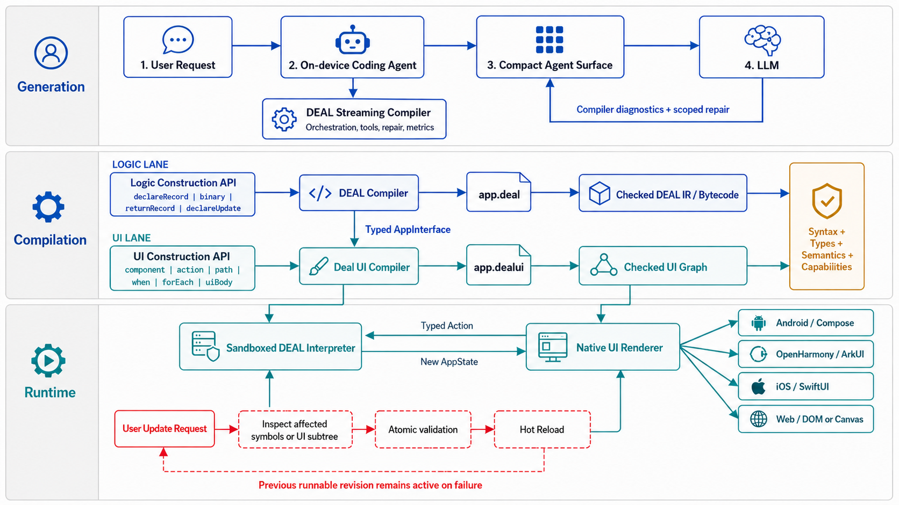

# DEAL Studio Architecture



Assume the user asks:

> Create a counter with a button that increments the value by one.

## 1. User Request

The request is handled by an on-device Coding Agent. The agent coordinates the LLM, compiler
transactions, validation, repair, and application revisions. It does not implement DEAL semantics
itself.

## 2. Compact Agent Surface

The Coding Agent does not send the complete compiler API or full application source to the LLM. The
Streaming Compiler builds a small, task-specific Agent Surface containing only the operations needed
for the current step.

For DEAL logic generation, this may include:

| Operation | Purpose |
| --- | --- |
| `declareRecord` | Declare application state, a data structure, or a nominal action. |
| `path` | Read a value such as `state.count` or `action.value`. |
| `binary` | Construct a typed operation such as `+`, `-`, `<`, or `==`. |
| `returnRecord` | Return a complete replacement state. |
| `local` / `assign` | Create and update fresh local variables. |
| `if` / `while` | Construct control flow. |
| `declareFunction` | Declare an ordinary helper function. |
| `declareUpdate` | Declare a state-update handler for a UI action. |

These are typed compiler operations, not instructions to generate arbitrary source code.

## 3. DEAL Logic Generation

The LLM constructs the counter through the compiler API:

```text
declareRecord AppState { count: int }
declareRecord IncrementAction {}

nextCount = binary("+", path("state.count"), 1)

declareUpdate onIncrement {
  returnRecord { count: nextCount }
}
```

The DEAL compiler validates every constructor call and projects the accepted graph into canonical,
readable `app.deal` source:

```ts
export function onIncrement(
  state: AppState,
  action: IncrementAction
): AppState {
  return { count: state.count + 1 };
}
```

The LLM does not submit executable source strings. The compiler owns source construction, formatting,
identifiers, type checking, and semantic validation.

## 4. Compiler-Guided Repair

If the model uses an invalid value, the compiler rejects only the affected operation and returns a
structured repair contract:

```text
Diagnostic: DEAL-TYPE-104
Location: onIncrement / addition
Expected: int
Actual: string
Allowed repair: replace the rejected expression
```

The next LLM request contains only the failed slot, its required dependencies, and the permitted
repair tool. Accepted declarations and handlers remain staged and cannot be regenerated accidentally.

The guarantee applies to the final admitted artifact: every runnable application is syntactically and
semantically accepted by the compiler. Logical mistakes are still possible and require tests or user
validation.

## 5. Typed AppInterface

After DEAL compilation, the compiler extracts a small read-only contract for UI generation:

```text
State:
  count: int

Actions:
  IncrementAction -> onIncrement
```

The UI model cannot invent state fields, actions, or platform capabilities that are not present in
this interface.

## 6. Deal UI Generation

The UI model receives the `AppInterface`, relevant component contracts, and a compact UI construction
API:

| Operation | Purpose |
| --- | --- |
| `component` | Create a typed component from the component pack. |
| `action` | Bind an event to an existing DEAL action. |
| `path` | Bind a component property to application state. |
| `when` | Create a conditional UI subtree. |
| `forEach` | Render a dynamic collection. |
| `uiBody` | Construct a complete view body. |

The model also receives exact component contracts:

```text
IntText(value: int)
Button(text: string, onClick: Action)
Column(children: View[])
```

It can then construct:

```text
counter = IntText(value: path("state.count"))

button = Button(
  text: "Add one",
  onClick: IncrementAction
)

uiBody(Column(counter, button))
```

The Deal UI compiler validates components, properties, children, state paths, action bindings,
accessibility, and capabilities. It then produces canonical `app.dealui` and a checked portable UI
graph.

## 7. Canonical Application

The persistent application consists of:

```text
app.deal    - state, business logic, actions, and effects
app.dealui  - layout, bindings, interaction, and theme
metadata    - compiler versions, digests, model, and metrics
```

ASTs, semantic graphs, AppInterface snapshots, bytecode, checked UI IR, and runtime instances are
derived artifacts and can be rebuilt from the canonical sources.

## 8. Execution and Native Rendering

`app.deal` is compiled into compact bytecode or IR and executed by a bounded sandboxed interpreter.
`app.dealui` becomes a portable UI graph rendered using native components.

```text
Android       -> Java runtime and Jetpack Compose in the current prototype
OpenHarmony   -> ArkTS/native runtime and ArkUI in the target implementation
iOS           -> native runtime adapter and SwiftUI/UIKit
Web           -> Web runtime and DOM/Canvas
```

At runtime:

```text
User taps "Add one"
  -> IncrementAction
  -> onIncrement(state, action)
  -> new AppState { count: 1 }
  -> native UI re-renders
```

The LLM is not involved while the generated application is running.

## 9. Platform Capabilities

Notifications, health data, calendars, and OpenHarmony App Functions are exposed through a typed
capability manifest:

```text
notification.schedule
health.weight.read
activity.steps.read
storage.persist
```

The LLM sees only permitted capabilities. The compiler validates their signatures, and the runtime
checks permissions and allowlists before invoking platform adapters. The sandbox and capability
boundary provide security; transpilation to ArkTS alone is not a sufficient security mechanism.

## 10. Incremental Updates

Suppose the user later asks:

> Make the button green and add a Reset button.

The LLM receives compact compiler-generated indexes instead of the complete source files:

```text
DEAL:
  S1 AppState
  S2 IncrementAction
  S3 onIncrement

Deal UI:
  U1 AppTheme
  U2 Column
  U3 IntText -> state.count
  U4 Button -> IncrementAction
```

The LLM proposes what should be inspected:

```text
inspect_deal_change(AppState/module, addDeclaration)
inspect_deal_ui_change(U4, replaceSubtree)
```

The compiler, not the LLM, derives the minimum dependency cone. It returns only the relevant source
slice, state paths, compatible actions, component contracts, and permitted write operation.

The LLM decides which artifact appears relevant to the request. The compiler decides what the model
may read and modify. The Coding Agent orchestrates the interaction.

## 11. Atomic Hot Reload

The Reset request first adds `ResetAction` and its DEAL handler. The UI step then binds the new action
and changes the button styling. Both artifacts are fully compiled and cross-validated before
publication.

```text
LLM proposes a target
  -> compiler derives the dependency cone
  -> LLM submits a local typed operation
  -> compiler validates the complete application
  -> runtime atomically swaps the revision
```

UI-only changes preserve the existing DEAL runtime and application state. If the public
`AppInterface` changes, only affected UI bindings are revisited. If the `AppState` schema changes, the
runtime may require a state reset or an explicit migration. If validation fails, the previous working
revision remains active.

## Summary

The LLM proposes changes through a compact compiler API. The DEAL and Deal UI compilers own source
construction, type checking, semantic validation, diagnostics, and edit boundaries. The Coding Agent
orchestrates model calls and compiler transactions but does not duplicate compiler semantics. DEAL
Studio executes only fully validated canonical applications through a sandboxed cross-platform runtime
and a native UI renderer.
