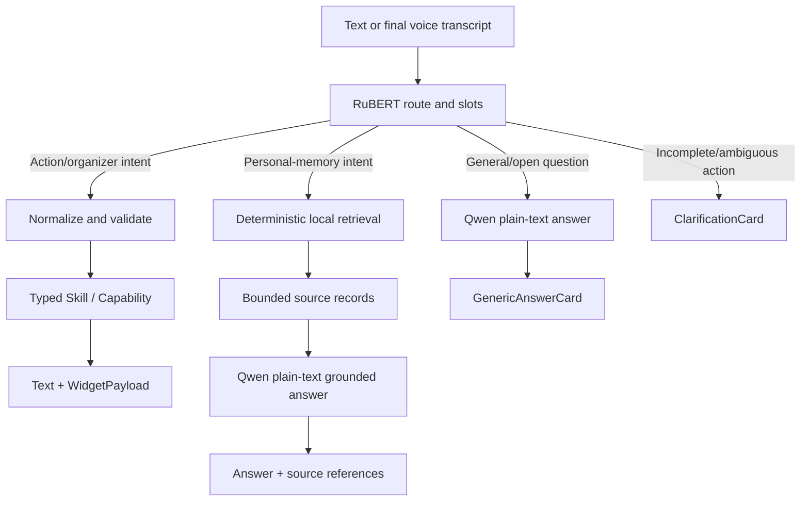

# Local Personal Operator vNext Improvement Plan

Date: 2026-07-14
Status: proposed execution plan; current PoC Definition of Done remains complete
Target platform: Android 16+, with graceful degradation to the existing minSdk 26 product core

## 1. Purpose

Turn the stabilized Android Offline Assistant PoC into a coherent local personal operator:

- instant deterministic phone and organizer actions through RuBERT;
- private notes, tasks and calendar context stored or accessed on device;
- grounded Qwen answers over a bounded set of local records;
- safe Android controls with explicit permissions, confirmation and undo;
- natural voice input/output without blocking the UI;
- optional online connectors that never become dependencies of the offline core.

This plan extends, but does not invalidate, the current completed PoC baseline:

- `docs/superpowers/specs/2026-07-09-android-offline-assistant-poc-design.md`;
- `docs/superpowers/plans/2026-07-13-project-wide-ux-optimization.md`;
- `docs/product/2026-07-14-competitive-landscape-and-product-directions.md`.

## 2. Product Position

### Local Personal Operator

Product promise:

> Быстро зафиксировать мысль, найти личную информацию и безопасно выполнить действие на телефоне без отправки голоса и персональной памяти в облако.

The product does not compete on general model intelligence. Its advantages are:

- full local ASR/NLU/LLM/TTS operation;
- a fast action path that never waits for Qwen;
- typed and testable actions instead of LLM-generated tool calls;
- local personal memory with visible source records;
- useful offline behavior with explicit freshness labels for data that normally syncs online;
- predictable permission, confirmation, Stop and undo behavior.

## 3. Non-Negotiable Architecture

1. T-one/Whisper perform speech recognition only.
2. RuBERT selects action and organizer intents plus slots.
3. Qwen returns plain visible text only.
4. Qwen never generates command JSON, selects Android actions or repairs low-confidence action classification.
5. Android UI renders `AssistantResponse` and `WidgetPayload`; it does not contain business rules.
6. Reusable schemas, normalizers, skills, stores, retrieval and response contracts stay in `:core`.
7. Android permissions, providers, services, Room, intents and JNI stay in `:app`.
8. Every destructive or externally visible action has an explicit confirmation policy.
9. Raw microphone audio is not retained by default.
10. Online email/weather freshness is labelled and cannot silently masquerade as offline data.

## 4. Three Product Lanes



### 4.1 Reflex lane

`ASR -> RuBERT -> normalization -> Skill -> widget`

Owns every mutation, phone action and organizer command. It must remain fast, deterministic and independently testable.

### 4.2 Memory lane

`memory intent -> deterministic retrieval -> bounded evidence -> Qwen text -> source links`

Qwen may summarize or compare records, but retrieval and access control happen before the model. No record is mutated from Qwen output.

### 4.3 Answer lane

`general question -> Qwen streaming text -> local TTS`

This remains the existing answer-only path. Fresh online facts must be declined or explicitly use an optional labelled provider.

## 5. Target Information Architecture

Primary product surfaces:

1. **Chat** - commands, answers, action widgets and conversational repair.
2. **Today** - calendar agenda, due tasks, reminders and active timers.
3. **Inbox** - unprocessed notes/tasks, search and lists/projects.
4. **Settings** - models, speech, permissions, privacy, connectors and data management.

Internal-only surfaces:

- Debug/History;
- Widget Preview;
- model benchmarks and runtime telemetry;
- capability and permission diagnostics.

Before replacing the existing bottom navigation, create updated phone mocks based on the approved Blue Reference direction. Do not add Today/Inbox by simply crowding the existing navigation.

## 6. New Core Contracts

Add only when the corresponding milestone starts:

```kotlin
data class CapabilityDescriptor(
    val id: String,
    val requiredAccess: Set<String>,
    val confirmationPolicy: ConfirmationPolicy,
    val reversible: Boolean,
    val supportsBackgroundExecution: Boolean,
    val dataSensitivity: DataSensitivity,
)

data class SourceReference(
    val sourceType: String,
    val sourceId: String,
    val title: String?,
    val excerpt: String?,
    val updatedAt: String?,
)

data class GroundedAnswerRequest(
    val question: String,
    val sources: List<SourceReference>,
)

data class ActionPlan(
    val id: String,
    val steps: List<ActionStep>,
    val requiresConfirmation: Boolean,
)
```

Supporting contracts:

- `TaskStore`, `TaskListStore`, expanded `NoteStore`;
- `PersonalSearchRepository`;
- `CalendarGateway`;
- `NotificationGateway`;
- `EmailGateway` with explicit offline/freshness capabilities;
- `RoutineStore` and typed trigger/condition/action definitions;
- `UndoToken` for reversible local mutations;
- `CapabilityAvailability` for permission/access/provider state.

Do not implement all contracts upfront. Each one must arrive with a real use case and tests.

## 7. Data Model

### 7.1 Room-backed organizer

Migrate growing product data from SharedPreferences to Room:

- `NoteEntity`;
- `TaskEntity`;
- `TaskListEntity`;
- `ChecklistItemEntity`;
- `TagEntity` and cross references only if tags are included in the first UI;
- `ActionHistoryEntity` for bounded audit/undo metadata.

Initial task fields:

- stable UUID;
- title and optional details;
- status;
- due datetime and timezone;
- recurrence rule;
- priority;
- list/project id;
- created/updated/completed timestamps;
- source type and source reference when created from another record.

### 7.2 Search

Start with Room FTS over titles and bodies. Do not add embeddings until:

- FTS quality is evaluated on a fixed personal-memory query set;
- the embedding model, index size, latency and PSS are measured;
- hybrid ranking demonstrably improves retrieval.

### 7.3 Calendar

Calendar events remain owned by Android `CalendarContract`. Store only assistant-side references, cached display metadata where necessary and permission state. Never duplicate the full calendar as a second source of truth.

### 7.4 Email

The offline core stores no full mailbox by default. A future provider connector may maintain an explicitly enabled, encrypted and bounded local cache after a separate privacy/threat-model review.

### 7.5 Migration

- preserve existing notes/reminders/chat history;
- use explicit Room schema versions and migration tests;
- make migration idempotent;
- retain a rollback/export path before destructive migration;
- do not migrate raw audio because it is not product data.

## 8. Milestone 0 - Stabilize and Instrument the Current Demo

### Deliverables

- Fix generation cancellation so finalizing a stopped partial Qwen response cannot restart automatic TTS.
- Add a regression test for Stop generation plus Stop speech sequencing.
- Add inter-chunk playback telemetry:
  - synthesized chunk ready;
  - queued to `AudioTrack`;
  - playback-head start/end;
  - transport underflow/gap if present.
- Preserve the existing first-token-to-first-audio metric.
- Add one mixed 20-iteration device loop: RuBERT action, Qwen answer, Stop, microphone, repeat.
- Reconcile the two documented warm PSS figures and record one reproducible measurement procedure.

### Acceptance

- stopped speech never restarts for the same message;
- stopped generation leaves one partial assistant message and no duplicate audio;
- composer remains interactive throughout;
- mixed loop completes with no crash, ANR, stuck audio focus or blocked UI;
- all current core/app tests and targeted Pixel speech/Qwen tests pass.

## 9. Milestone 1 - Organizer Foundation

### Deliverables

- Room database and migration from current note/reminder stores.
- Core task/list/checklist contracts and Android repositories.
- CRUD intents, normalization and skills:
  - `create_task`;
  - `list_tasks`;
  - `search_tasks`;
  - `complete_task`;
  - `reschedule_task`;
  - `delete_task`;
  - `list_notes`;
  - `search_notes`;
  - `append_note`;
  - `edit_note`;
  - `delete_note`;
  - `create_task_list`;
  - `get_today_overview`.
- Complete existing in-app timer voice lifecycle:
  - `get_timer_status`;
  - `pause_timer`;
  - `resume_timer`;
  - `cancel_timer`.
- New widgets:
  - `TaskCard`;
  - `TaskListCard`;
  - `TodayCard`;
  - `SearchResultsCard`;
  - `UndoCard` or inline undo action.
- Inbox and Today UI skeletons with deterministic sample previews.

### NLU strategy

- Add intents in small domain batches, not all at once.
- Expand synthetic and human-written paraphrase data before retraining.
- Keep a confusion matrix for create/list/search/edit/delete distinctions.
- If intent proliferation materially lowers macro F1, evaluate a domain-first classifier; do not hide confusion with string heuristics.

### Acceptance

- data survives process death and app restart;
- migration preserves existing records exactly once;
- all CRUD actions work by text and render the correct widget;
- destructive actions require confirmation and expose undo when reversible;
- Today is generated from stores, timers and reminders without Qwen;
- 5,000 mixed notes/tasks search in under 100 ms P95 on Pixel 10;
- airplane-mode organizer flow passes.

## 10. Milestone 2 - Calendar and Date Language

### Deliverables

- Extend generic Russian ITN for dates, ordinals, weekdays and relative date ranges.
- `CalendarGateway` with two modes:
  - delegated `ACTION_INSERT` without broad permission;
  - integrated read/write through `CalendarContract` after explicit permission.
- Intents:
  - `get_agenda`;
  - `find_calendar_event`;
  - `create_calendar_event`;
  - `reschedule_calendar_event`;
  - `cancel_calendar_event`;
  - `find_free_time`;
  - `create_focus_block`.
- Widgets:
  - `AgendaCard`;
  - `CalendarEventCard`;
  - `FreeTimeCard`;
  - `EventConfirmationCard`.
- Calendar rows integrated into Today.
- Clear freshness copy: local provider state versus last external sync.

### Safety

- event creation may use delegated system confirmation;
- moving/deleting an event requires explicit confirmation;
- adding attendees or sending invitations is a separate confirmed action;
- Qwen may narrate an agenda but cannot create or alter it.

### Acceptance

- missing permission produces a correct `PermissionCard`;
- delegated creation opens a prefilled system Calendar screen;
- integrated agenda handles recurring event instances and timezones;
- free-time results derive from provider data and expose the searched interval;
- fixed date/ordinal ITN corpus passes without phrase-specific corrections;
- calendar-disabled and no-calendar-provider states produce useful errors.

## 11. Milestone 3 - Voice-First Capture and Conversational Repair

### Phase 3A: single-object repair

- Add `PendingCommand` state independent of chat display state.
- Support follow-ups such as:
  - `Нет, на пятницу`;
  - `Назови задачу Отчет`;
  - `Отмена`;
  - `Сохрани как заметку`.
- Keep corrections typed: update known pending slots or change a draft type through explicit intents.
- Render an editable Draft Card before commit when ambiguity exists.

### Phase 3B: short brain dump

- Add a separate typed draft extractor for multiple task/note candidates.
- Train and evaluate it independently; do not use Qwen command JSON.
- Stream draft cards while the transcript stabilizes.
- Commit once after user review.

### UX

- stable and mutable transcript portions remain visually distinct;
- draft objects never jump or reorder as partial ASR changes;
- touch and speech corrections modify the same draft state;
- one Stop cancels capture without committing partial items.

### Acceptance

- a fixed real-speech corpus covers one item, multiple items, corrections, deletion and ambiguity;
- only final transcript content is committed;
- false endpoint and missed endpoint rates are recorded;
- downstream object accuracy, not transcript wording alone, is the product gate;
- no command-specific transcript repair is introduced.

## 12. Milestone 4 - Grounded Personal Memory

### Deliverables

- `PersonalSearchRepository` over notes, tasks and assistant-owned reminders.
- Memory intents:
  - `search_personal_memory`;
  - `summarize_personal_context`;
  - `compare_personal_records`;
  - `get_daily_briefing`.
- Deterministic retrieval and ranking before Qwen.
- Strict bounded context builder with source ids, timestamps and excerpts.
- Qwen prompt for plain-text grounded answers only.
- `GroundedAnswerCard` with tappable source references and a no-evidence state.
- Qwen may read a deterministic Today snapshot as a natural briefing.

### Guardrails

- no mutation tools are exposed to Qwen;
- no source means an explicit abstention, not an invented personal fact;
- source count and context characters are capped;
- sensitive source types are excluded unless explicitly enabled;
- retrieved records and prompt context stay out of production logs.

### Acceptance

- fixed retrieval set reports Recall@K and answer source coverage;
- grounded answers cite at least one actually retrieved source;
- unsupported personal questions abstain;
- source deletion removes the record from future answers;
- Qwen output cannot cause a Skill execution;
- complete memory flow passes with package networking denied.

## 13. Milestone 5 - Safe Phone Operator

### Capability framework

- Implement `CapabilityDescriptor`, availability checks and confirmation policy.
- Expose permission/access onboarding as product cards.
- Keep an execution audit with bounded metadata and no private payload dump.

### First capabilities

- battery, storage, network and audio status;
- flashlight;
- volume and brightness;
- Wi-Fi/internet/NFC/volume settings panels where direct mutation is restricted;
- open application/settings;
- media play/pause/next after explicit notification/media access;
- read-only notification inbox and grouping;
- local notification digest;
- call and SMS drafts through public Android intents.

### Widgets

- `DeviceStatusCard`;
- `SettingActionCard`;
- `MediaCard`;
- `NotificationDigestCard`;
- `CommunicationDraftCard`;
- shared confirmation/progress/error surfaces.

### Acceptance

- every capability reports supported/unavailable/permission-required states;
- no no-op action buttons;
- direct controls are tested on Pixel and delegated controls verify the outgoing intent;
- notification access is opt-in and revocable;
- replies/calls/messages require confirmation or system takeover;
- no AccessibilityService UI clicking is used.

## 14. Milestone 6 - Email

### Phase 6A: offline-safe baseline

- `draft_email` through a prefilled mail client;
- recent email-like notification search and digest;
- `EmailDraftCard` and `EmailDigestCard`;
- Qwen may rewrite user-selected draft text but cannot select recipients or send.

### Phase 6B: optional provider connector

- separate connector interface and build/runtime capability flag;
- Gmail OAuth with minimal scopes or standards-based IMAP after a security review;
- explicit online/offline/cache freshness state;
- bounded encrypted local cache only after the threat model is approved;
- search, thread summary and archive-with-undo where supported.

### Acceptance

- the app never claims mailbox coverage when only notifications are available;
- sending always requires preview/confirmation in the mail app or assistant UI;
- connector failure cannot break the offline organizer/assistant core;
- revoking OAuth/access removes connector functionality and cached sensitive data according to the documented policy;
- online provider calls and cached answers are visibly labelled.

## 15. Milestone 7 - Routines and Visible Multi-Step Plans

### Deliverables

- typed `trigger + conditions -> actions` model;
- supported first triggers: time, charging/battery, connectivity, headphones and selected notification categories;
- constrained routine builder; no arbitrary scripts;
- dry run, enable switch, execution history and global kill switch;
- `ActionPlanCard` with per-step status, confirmation, Stop and partial failure;
- background scheduling through appropriate Android components, respecting platform limits.

### Rules

- routines are user-authored or explicitly confirmed;
- Qwen may explain a routine in text but cannot generate and silently enable it;
- sensitive actions cannot be background-confirmed;
- every action in a plan uses the same individual capability contract as chat.

### Acceptance

- routines survive process death and reboot when platform policy allows;
- duplicate trigger delivery is idempotent;
- Stop prevents remaining actions;
- partial failure is visible and does not mark the whole plan successful;
- battery impact is measured over an idle device interval.

## 16. Milestone 8 - Assistant Shell

### Deliverables

- `ROLE_ASSISTANT` / `VoiceInteractionService` compatibility spike;
- compact cutout-safe `VoiceInteractionSession` using the existing engine;
- Quick Settings tile and launcher/widget capture entry points;
- lock-screen policy for a small allowlist of non-sensitive actions;
- hardware/headset invocation experiment where public APIs permit it.

### Explicitly deferred

- continuous custom wake word;
- unrestricted screen-content ingestion;
- background microphone capture;
- AccessibilityService-based general app automation.

### Acceptance

- selecting and removing the assistant role is reversible;
- invocation reuses the same stores, engine and telemetry;
- no duplicate model contexts are created by the service and Activity;
- sensitive actions require unlock/confirmation;
- battery and resident memory impact are documented.

## 17. Milestone 9 - Android AppFunctions Experiment

AppFunctions are experimental and currently require a compileSdk 37-compatible setup, while the product uses compileSdk/targetSdk 36.

### Deliverables

- isolated branch or module for the SDK/API experiment;
- export only:
  - `createTask`;
  - `listTasks`;
  - `completeTask`;
  - `createNote`;
  - `searchNotes`;
- adapter delegates into existing core services;
- registration and execution tests with the Android sample test agent;
- capability flag so the production app does not depend on preview availability.

### Acceptance

- no business logic moves into AppFunction annotations/services;
- unsupported devices retain full in-app behavior;
- external execution follows the same confirmation and permission policy;
- preview dependency does not enter the stable build until explicitly approved.

## 18. UI and Design Workstream

Run alongside Milestones 1-6, with implementation only after mocks are approved.

### Required design artifacts

- Chat with action, grounded-answer, plan and confirmation states;
- Today with agenda/tasks/timers;
- Inbox and search;
- voice draft/correction flow;
- permission and connector onboarding;
- notification/email digest;
- compact assistant overlay;
- all new widget previews.

### Design rules

- preserve the Blue Reference visual language;
- no cards inside cards;
- use compact operational layouts, not marketing composition;
- keep all controls cutout-, gesture- and IME-safe;
- replace no-op affordances with real actions or remove them;
- show source/freshness/permission information in product language;
- keep debug model details out of primary UI;
- provide touch alternatives for every voice flow;
- test dynamic type and TalkBack semantics.

## 19. Model and Data Workstream

### RuBERT

- expand the schema in domain batches;
- maintain balanced paraphrase coverage;
- add confusion reports for CRUD pairs;
- keep joint intent and slot outputs;
- preserve generic slot normalization and raw transcript evidence.

Quality gates after each domain batch:

- intent accuracy >= 0.95;
- macro F1 >= 0.93 initially, target >= 0.95;
- slot F1 >= 0.90;
- normalized-command exact match >= 0.90;
- zero critical destructive-action confusion on the fixed safety subset.

### ASR

- keep T-one default and Whisper selectable;
- collect an opt-in real Russian command/capture corpus;
- compare NS/AGC only against downstream intent/object accuracy;
- extend personal entity vocabulary generically for contacts, projects, lists and places;
- do not add observed-phrase replacements.

### Qwen

- retain answer-only behavior and existing quality gate;
- add grounded-memory and briefing evaluation sets;
- test immutable prompt prefix, KV quantization and smaller contexts only behind quality gates;
- do not lower the generation ceiling to hide stopping bugs;
- consider a different non-thinking model only through the same fixed answer/latency/memory evaluation.

## 20. Performance Targets

Pixel 10 targets unless otherwise stated:

| Metric | Current evidence | vNext gate |
| --- | ---: | ---: |
| Cold startup median | about 342-348 ms | <= 400 ms, no regression > 10% |
| RuBERT runtime median | about 7 ms in provider matrix | <= 15 ms; P95 <= 40 ms |
| End of speech -> action widget | current full voice timer about 2.6 s | P50 <= 1.5 s; P95 <= 2.5 s |
| Warm Qwen visible TTFT | median about 2.1 s | P50 <= 1.5 s stretch; never trade away quality gate |
| First Qwen token -> first audible frame | median 1,029 ms | median <= 1,000 ms; P95 <= 1,300 ms |
| Organizer FTS over 5,000 records | not measured | P95 <= 100 ms |
| Calendar agenda query | not measured | P95 <= 200 ms for a 30-day range |
| Chat frame CPU P95 | about 11.6 ms | <= 16.7 ms in critical flows |
| Full warm PSS | about 1.73 GiB in latest full-stack result | no milestone regression > 10%; target <= 1.5 GiB after validated runtime experiments |
| Mixed interaction stability | targeted repeat tests | 50 mixed operations, zero crash/ANR/stuck audio focus |

Inter-chunk speech continuity must first be instrumented. Set a numeric silence target only after separating model-produced silence from transport underflow; transport-induced underflow count must be zero.

## 21. Privacy and Safety Gates

- airplane-mode acceptance for ASR, NLU, organizer, local memory answers and TTS;
- visible data-source label for weather, calendar sync state and email connector/cache state;
- no raw audio retention unless the user explicitly enables an evaluation recording;
- no personal source excerpts in production logs;
- one settings surface to revoke notification/calendar/email access and delete derived cache;
- confirmation for sending communications, deleting external data, changing calendar events and multi-step plans;
- undo for reversible local actions;
- audit records contain action metadata, not message bodies or complete prompt context;
- lock-screen allowlist excludes sensitive reads and communications by default.

## 22. Test Strategy

### Host/unit

- schemas, normalizers, skills and routing;
- Room migrations, repositories and FTS;
- capability availability and confirmation policy;
- deterministic retrieval and source bounding;
- grounded answer prompt isolation;
- date/time ITN;
- routine idempotency and plan cancellation.

### Compose

- every widget preview;
- Today/Inbox empty/loading/error/content states;
- draft correction and confirmation;
- grounded source navigation;
- plan progress/Stop/takeover;
- IME, cutout, gesture insets and dynamic type.

### Connected Pixel

- real T-one/Whisper -> RuBERT -> organizer/calendar widget;
- permission grants/revocation;
- Calendar Provider fixtures;
- notification/media access;
- repeated Qwen/TTS/Stop;
- process death/relaunch and reboot rescheduling;
- offline package-deny gate;
- mixed 50-operation soak.

### Macrobenchmark

- startup;
- microphone start;
- end of speech to action widget;
- opening Today with populated data;
- FTS search;
- Qwen first visible token;
- first token to first audio;
- long streaming answer scroll/jank.

## 23. Release Gates by Increment

### Demo v2 gate: Milestones 0-3

- stable current voice/Qwen/TTS flow;
- real tasks/lists/Today/calendar;
- voice correction for one pending object;
- no cloud dependency for the demo path.

### Personal Memory gate: Milestone 4

- local search plus source-linked grounded answers;
- no-evidence abstention;
- airplane-mode acceptance.

### Phone Operator gate: Milestones 5-6

- safe phone controls, notification digest, calendar and email draft;
- permissions and confirmations are product-complete;
- optional online email remains isolated.

### Assistant Shell gate: Milestones 7-9

- routines, assistant-role spike and AppFunctions experiment have separate go/no-go evidence;
- none is required to preserve the stable core app.

## 24. Risks and Mitigations

| Risk | Mitigation |
| --- | --- |
| RuBERT intent proliferation lowers accuracy | Add domains incrementally; inspect confusion; evaluate domain-first routing only when measured |
| Shared model residency exceeds phone memory | Preserve staged warm-up, trim callbacks and low-RAM policy; measure each milestone |
| Qwen hallucinates personal facts | Deterministic retrieval, bounded sources, source links and mandatory abstention tests |
| Calendar recurrence/timezone errors | Query `Instances`, preserve zones, add DST/recurrence fixtures |
| Email breaks the offline promise | Keep draft/notification baseline; label provider/cache; make connector optional |
| Android OEM behavior differs | Capability availability states and a broader device matrix before production claims |
| Routines consume battery or fire twice | Narrow triggers, platform schedulers, idempotency keys and idle battery tests |
| UI becomes a dense collection of cards | Approve information architecture and mocks before implementation; use cards only for discrete results |
| AppFunctions API churn | Isolated experiment, feature flag and no business logic dependency |
| Personal data exposure through logs/debug | Redaction tests, bounded debug history and explicit cache deletion |

## 25. Recommended Execution Order

1. Milestone 0: cancellation/audio lifecycle and telemetry.
2. Milestone 1: Room organizer, CRUD and Today foundation.
3. UI mock review for Chat/Today/Inbox and new widgets.
4. Milestone 2: date ITN and calendar.
5. Milestone 3A: pending-command repair.
6. Milestone 4: FTS-backed personal memory and grounded Qwen.
7. Milestone 5: safe phone capabilities and notifications.
8. Milestone 6A: email drafts and notification-derived digest.
9. Milestone 3B: multi-item voice capture only after single-object evaluation is stable.
10. Milestone 7: routines and visible plans.
11. Milestone 8: assistant-role shell.
12. Milestone 9 and Email 6B as isolated experimental tracks.

## 26. vNext Definition of Done

The next product increment is complete when:

- current text/voice/RuBERT/Qwen/TTS behavior remains stable;
- Qwen Stop and speech Stop cannot restart or duplicate output;
- notes, tasks, lists and checklists persist in Room;
- users can create, find, edit, complete/reschedule and delete organizer items;
- Today combines tasks, reminders, timers and Calendar Provider events;
- voice correction works for a pending organizer/calendar command;
- local search answers link to real source records and abstain without evidence;
- core phone controls expose correct permission/availability/confirmation states;
- notification digest and email draft flows are implemented without claiming a full offline mailbox;
- all core organizer, memory and action flows work with package networking denied;
- Debug shows route, transcript, intent, confidence, normalized command, selected sources, execution result and latency without leaking private bodies;
- fixed host, connected, performance, privacy and mixed-soak gates pass;
- docs and `AGENTS.md` are updated to the implemented architecture rather than marking planned work as complete.
